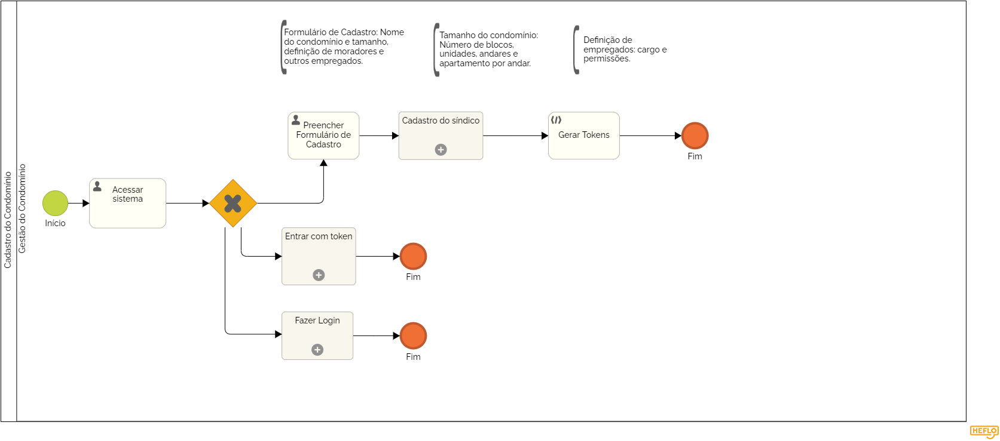

### 3.3.1 Processo 1 – CADASTRO DO CONDOMÍNIO

O Cadastro do Condomínio é o processo inicial essencial para quem deseja começar a utilizar nosso programa de gestão de condomínios. Este processo estabelece a base para o funcionamento do sistema e é crucial para garantir que todos os dados necessários sejam coletados e configurados corretamente.

**Descrição do Processo:**

**1. Preenchimento do Formulário do Condomínio:**

* O usuário inicia o processo preenchendo um formulário detalhado sobre o condomínio. Este formulário coleta informações essenciais, como o tamanho do condomínio, o número de apartamentos e especificações adicionais. Além disso, o formulário inclui a definição dos usuários administrativos que serão responsáveis pela gestão, como o zelador. É aqui que o síndico pode definir e ajustar as permissões e cargos dos funcionários, garantindo que cada um tenha acesso às funcionalidades necessárias para suas funções.

**2. Cadastro do Síndico:**

* Após o preenchimento do formulário, o sistema solicita o cadastro do síndico. O síndico deve fornecer informações como nome, contato e dados de autenticação. Este passo é crucial para garantir que o responsável pela gestão do condomínio seja registrado e possa acessar o sistema com as permissões adequadas.

**3. Geração de Tokens:**

Após o formulário ser preenchido, o sistema gera tokens únicos para os moradores e funcionários do condomínio.

* **Tokens para Moradores:** Cada apartamento recebe um token específico, permitindo que os moradores se cadastrem no site e se vinculem diretamente ao seu apartamento.

* **Tokens para Funcionários:** Os tokens para funcionários são gerados com base nas informações fornecidas pelo síndico. Estes tokens definem cargos e permissões, permitindo que cada funcionário acesse o sistema com suas credenciais apropriadas.

Este processo de cadastro é fundamental para configurar o condomínio no sistema e garantir que todas as informações estejam corretamente alinhadas para a gestão eficiente e segura do ambiente condominial.

**Oportunidades de Melhoria no Cadastro do Condomínio**

**Desafios Anteriores:**

* Muitos condomínios não utilizavam plataformas digitais adequadas ou usavam plataformas genéricas que não definem permissões específicas, resultando em confusão e gestão ineficiente.
* A gestão manual e a falta de automação causavam erros e atrasos.
  
**Melhorias Implementadas:**

* Processo Estruturado: O novo processo de cadastro estabelece um fluxo inicial claro e automatizado para configuração do condomínio.
* Formulário Detalhado: Coleta informações completas e específicas, facilitando a definição precisa de dados do condomínio e de administradores.
* Cadastro do Síndico: Inclusão do cadastro do síndico garante que o responsável pela gestão esteja registrado e tenha acesso apropriado ao sistema.
* Geração Automática de Tokens: Tokens são gerados automaticamente para moradores e funcionários, garantindo acesso adequado e segurança.
* Controle de Permissões: Permissões são definidas de forma integrada pelo síndico, evitando confusões e melhorando a gestão.

**Subprocesso 1: Entrar com Token**

**Subprocesso 2: Fazer Login**

**Subprocesso 3: Cadastro do Síndico**

#### Detalhamento das atividades

**Atividade 1: Acessar sistema**

| **Comandos**         |  **Destino**                   | **Tipo** |
| ---                  | ---                            | ---               |
| [Fazer login] | Processo de Login   |default|
| [Usar Token]       |          Processo de Token               |   default                |
| [Cadastre seu condomínio]           | Cadastro do Condomínio              | default       |

**Atividade 2: Preencher Formulário de Cadastro**

| **Campo**       | **Tipo**         | **Restrições** | **Valor default** |
| ---             | ---              | ---            | ---               |
| nome do condomínio | 	Caixa de Texto  |                |                   |
|  número de blocos  |   Número   |  valor inteiro positivo   |                   |
|  andares  |    Número   |     valor inteiro positivo   |  valor inteiro positivo   |
|  apartamentos por andar  |   Número   | valor inteiro positivo  |                   |

| **Comandos**         |  **Destino**                   | **Tipo**          |
| ---                  | ---                            | ---               |
| [Próximo] |Processo de Cadastro de Outros Empregados  | default |

**Atividade 2.1: Definição de Outros Empregados**

| **Campo**       | **Tipo**         | **Restrições** | **Valor default** |
| ---             | ---              | ---            | ---               |
| Quantidade de funcionários | Seleção Única  |     lista de números           |     |    
| Cargo dos empregados | Seleção Única		  | lista de cargos possíveis ou outros |                   |
| Qual (se aplicável) | Caixa de Texto		  | obrigatório |                   |

**Atividade 2.2: Campos de Marcadores para Definições de Permissões:**
| **Campo**       | **Tipo**         | **Restrições** | **Valor default** |
| ---             | ---              | ---            | ---               |
| Editar Área Comum | Seleção Única  |                |                   |
|  Editar Entregas | Seleção Única |                |                   |
|  Editar Ouvidoria |  Seleção Única  |                |                   |
|  Editar Entregas e Encomendas | Seleção Única  |                |                   |
|  Editar Prestação de Contas | Seleção Única  |                |                   |
|  Editar Financeiro | Seleção Única |                |                   |
|  Editar Mural de Avisos | Seleção Única  |                |                   |
|  Editar Achados e Perdidos |  Seleção Única  |                |                   |
|  Editar Contatos |Seleção Única  |                |                   |
|  Editar Regras e Normas do Condomínio |Seleção Única|                |                  
|  Editar Assembleias | Seleção Única |                |                   |
|  Editar Achados e Perdidos | Seleção Única  |                |                   |
|Visualizar lista de Moradores Completa| Seleção Única |                |                   |
|Visualizar lista de Veículos e Nomes|Seleção Única |                |                   |
|  Visualizar lista de Visitantes |Seleção Única |                |                   |

| **Comandos**         |  **Destino**                   | **Tipo**          |
| ---                  | ---                            | ---               |
| [Próximo] |Processo de Cadastro do Síndico  | default |

**Atividade 3: Cadastro do Síndico**

| **Campo**       | **Tipo**         | **Restrições** | **Valor default** |
| ---             | ---              | ---            | ---               |
| Nome | 	Caixa de Texto  |                |                   |
|  e-mail  |   Número   |  formato de e-mail   |                   |
|  número de telefone  |    Número   |        |     |
|  login  |    Caixa de Texto   | formato de e-mail       |     |
|  senha  |    Caixa de Texto   |     mínimo de 8 caracteres   |     |

| **Comandos**         |  **Destino**                   | **Tipo**          |
| ---                  | ---                            | ---               |
| [Próximo] | Início da Geração de Tokens  | default |

