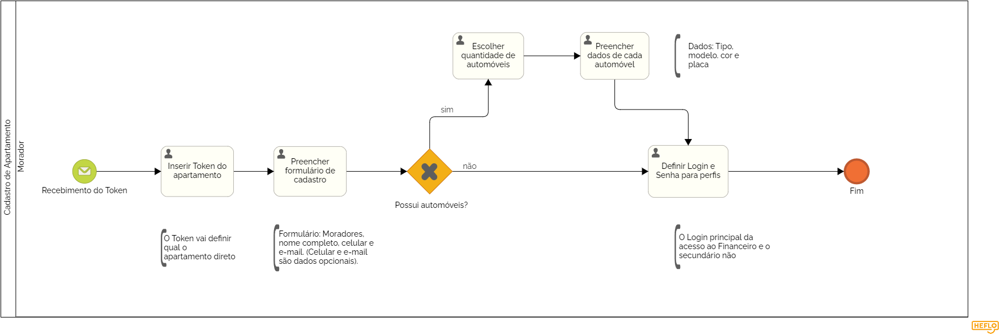

### 3.3.2 Processo 2 – CADASTRO DE APARTAMENTO

O Cadastro de Apartamento é um processo essencial para garantir que cada unidade residencial no condomínio esteja devidamente configurada no sistema. Este processo permite que os moradores associem suas unidades e personalizem suas informações, garantindo acesso adequado às funcionalidades da plataforma.

**Descrição do Processo:**

**1. Recebimento do Token:**

* Após o cadastro do condomínio e a geração dos tokens, o síndico envia um token único para cada apartamento. Este token é fundamental para vincular o apartamento ao sistema e iniciar o processo de cadastro.

**2. Acesso à Plataforma:**

O morador utiliza o token recebido para acessar a plataforma de gestão do condomínio. O token preenche automaticamente o campo referente ao apartamento, vinculando a unidade ao cadastro.

**3. Preenchimento do Formulário de Cadastro:**

* Após o acesso, o morador preenche um formulário detalhado com as seguintes informações:

* Informações do Apartamento: Inclui dados como número do apartamento e outros detalhes relevantes.
* Informações dos Moradores: O formulário permite que o morador adicione informações dos residentes, como nome e, opcionalmente, contato.
* Informações sobre Automóveis: Caso o apartamento possua veículos, o morador preenche um formulário adicional com dados como quantidade de carros, tipo, modelo, cor e placa.
  
**4. Definição de Login e Senha:**

* O morador define login e senha para acessar a plataforma. São criados dois perfis de acesso:

* Perfil Principal: Tem acesso completo às funcionalidades da plataforma, incluindo áreas financeiras e administrativas.
* Perfil Secundário: Tem acesso restrito, não podendo visualizar informações financeiras, mas podendo realizar ações como marcar reservas em áreas comuns.
Este processo de cadastro garante que cada apartamento esteja corretamente registrado no sistema e que todos os moradores tenham acesso às funcionalidades apropriadas de acordo com seus perfis.

**Oportunidades de Melhoria no Cadastro de Apartamento**

**Desafios Anteriores:**

* A falta de um processo centralizado para o cadastro de apartamentos e moradores causava confusão e erros na associação de unidades e informações pessoais.
* A gestão manual e a falta de automação dificultavam o gerenciamento das informações dos moradores e veículos.

**Melhorias Implementadas:**

* Processo Estruturado: O novo processo estabelece um fluxo claro e automatizado para o cadastro de apartamentos, melhorando a precisão e eficiência.
* Uso de Tokens: Tokens gerados e enviados pelo síndico garantem que o apartamento seja associado corretamente ao sistema.
* Formulário Detalhado: Coleta informações completas dos moradores e veículos, facilitando o gerenciamento e a organização.
* Perfis de Acesso: A definição de diferentes perfis de acesso garante que cada morador tenha a visualização e controle apropriados sobre suas informações e funcionalidades.

#### Detalhamento das atividades

_Descreva aqui cada uma das propriedades das atividades do processo 1. 
Devem estar relacionadas com o modelo de processo apresentado anteriormente._

_Os tipos de dados a serem utilizados são:_

_* **Área de texto** - campo texto de múltiplas linhas_

_* **Caixa de texto** - campo texto de uma linha_

_* **Número** - campo numérico_

_* **Data** - campo do tipo data (dd-mm-aaaa)_

_* **Hora** - campo do tipo hora (hh:mm:ss)_

_* **Data e Hora** - campo do tipo data e hora (dd-mm-aaaa, hh:mm:ss)_

_* **Imagem** - campo contendo uma imagem_

_* **Seleção única** - campo com várias opções de valores que são mutuamente exclusivas (tradicional radio button ou combobox)_

_* **Seleção múltipla** - campo com várias opções que podem ser selecionadas mutuamente (tradicional checkbox ou listbox)_

_* **Arquivo** - campo de upload de documento_

_* **Link** - campo que armazena uma URL_

_* **Tabela** - campo formado por uma matriz de valores_

**Nome da atividade 1**

| **Campo**       | **Tipo**         | **Restrições** | **Valor default** |
| ---             | ---              | ---            | ---               |
| [Nome do campo] | [tipo de dados]  |                |                   |
| ***Exemplo:***  |                  |                |                   |
| login           | Caixa de Texto   | formato de e-mail |                |
| senha           | Caixa de Texto   | mínimo de 8 caracteres |           |

| **Comandos**         |  **Destino**                   | **Tipo** |
| ---                  | ---                            | ---               |
| [Nome do botão/link] | Atividade/processo de destino  | (default/cancel  ) |
| ***Exemplo:***       |                                |                   |
| entrar               | Fim do Processo 1              | default           |
| cadastrar            | Início do proceso de cadastro  |                   |

**Nome da atividade 2**

| **Campo**       | **Tipo**         | **Restrições** | **Valor default** |
| ---             | ---              | ---            | ---               |
| [Nome do campo] | [tipo de dados]  |                |                   |
|                 |                  |                |                   |

| **Comandos**         |  **Destino**                   | **Tipo**          |
| ---                  | ---                            | ---               |
| [Nome do botão/link] | Atividade/processo de destino  | (default/cancel/  ) |
|                      |                                |                   |
