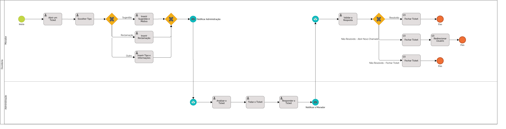

### 3.3.2 Processo 2 – Ouvidoria

#### Detalhamento das atividades

**Escolher Tipo**

| **Campo**       | **Tipo**         | **Restrições**                | **Valor default** |
| ---             | ---              | ---                           | ---               |
| Tipo do Ticket  | Seleção Única    | Sugestão, Reclamação ou Outro | Outro             |

**Inserir Sugestão e Motivo**

| **Campo**       | **Tipo**         | **Restrições**        | **Valor default** |
| ---             | ---              | ---                   | ---               |
| Sugestão        | Caixa de Texto   | Mínimo de 10 palavras | NULO              |
| Motivo          | Área de Texto    | Mínimo de 10 palavras | NULO              |

| **Comandos**         |  **Destino**                   | **Tipo**          |
| ---                  | ---                            | ---               |
| Enviar               | Analisar Ticket                | default           |

**Inserir Reclamação**

| **Campo**       | **Tipo**         | **Restrições**        | **Valor default** |
| ---             | ---              | ---                   | ---               |
| Reclamação      | Área de Texto    | Mínimo de 10 Palavras | NULO              |
| Anexo           | Imagens          | Nenhuma               | NULO              |

| **Comandos**         |  **Destino**                   | **Tipo**          |
| ---                  | ---                            | ---               |
| Enviar               | Analisar Ticket                | default           |

**Inserir Tipo e Informações**

| **Campo**       | **Tipo**         | **Restrições**        | **Valor default** |
| ---             | ---              | ---                   | ---               |
| Tipo            | Caixa de Texto   | Mais de 4 letras      | NULO              |
| Reclamação      | Área de Texto    | Mínimo de 10 Palavras | NULO              |
| Anexo           | Imagens          | Nenhuma               | NULO              |

| **Comandos**         |  **Destino**                   | **Tipo**          |
| ---                  | ---                            | ---               |
| Enviar               | Analisar Ticket                | default           |

**Responder o Ticket**

| **Campo**       | **Tipo**         | **Restrições**        | **Valor default** |
| ---             | ---              | ---                   | ---               |
| Resposta        | Área de Texto    | Mínimo de 10 Palavras | NULO              |

| **Comandos**         |  **Destino**                   | **Tipo**          |
| ---                  | ---                            | ---               |
| Enviar               | Validar Resposta               | default           |
