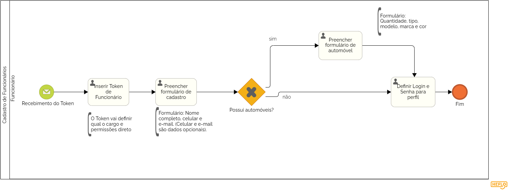

### 3.3.3 Processo 3 – CADASTRO DE FUNCIONÁRIOS

O cadastro de funcionários é essencial para garantir que todos os colaboradores do condomínio estejam registrados corretamente e com permissões adequadas. Esse processo assegura que cada funcionário tenha acesso às funcionalidades necessárias de acordo com sua

**Descrição do Processo:**

**1. Inserção do Token de Funcionário:**

* O funcionário inicia o processo inserindo um token exclusivo fornecido pelo síndico. Esse token vincula o funcionário diretamente ao sistema e ao seu cargo, configurando automaticamente permissões básicas associadas às suas responsabilid

**2. Acesso à Plataforma:**
   
* Após a inserção do token, o funcionário é redirecionado à plataforma de gestão do condomínio, onde o sistema já identifica seu cargo e associa as permissões adequadas.

**3. Preenchimento do Formulário de Cadastro:**

* O funcionário preenche um formulário com suas informações pessoais, como nome, e-mail, telefone, e cargo.

**4. Definição de Login e Senha:**
   
* O funcionário define seu login e senha para acessar a plataforma. Esse acesso será utilizado para executar suas atividades e interagir com os moradores e outros funcionários.

**5. Configuração de Permissões:**
   
* Com base no cargo associado ao token, o sistema atribui automaticamente as permissões de acesso, que poderão ser revisadas e ajustadas pelo síndico conforme necessário.

**Oportunidades de Melhoria no Cadastro de Funcionário**

**Desafios Anteriores:**

* A falta de automação no processo de cadastro dificultava a gestão das responsabilidades e permissões dos funcionários, levando a confusões e erros.
* Os cadastros manuais demandavam muito tempo para revisão e ajuste das permissões.

**Melhorias Implementadas:**

* Uso de Tokens: Os tokens fornecidos pelo síndico automatizam o vínculo do funcionário ao sistema e facilitam a atribuição de permissões adequadas.
* Processo Automatizado: A nova estrutura do processo agiliza o cadastro e garante que os funcionários tenham acesso apenas às funcionalidades necessárias para suas atividades.
* Revisão Simples: O sistema permite que o síndico revise e ajuste as permissões facilmente, garantindo flexibilidade e controle eficiente sobre os acessos de cada funcionário.

#### Detalhamento das atividades

**Atividade 1: Acessar sistema via Token**

| **Comandos**         |  **Destino**                   | **Tipo**          |
| ---                  | ---                            | ---               |
|[Inserir Token] | Processo de Validação de Token  | default |

**Atividade 2: Preencher Formulário de Cadastro de Funcionário**

| **Campo**       | **Tipo**         | **Restrições** | **Valor default** |
| ---             | ---              | ---            | ---               |
| Cargo | Caixa de Texto  |  Auto-preenchido pelo Token | Preenchido automaticamente  |
|nome |   Caixa de Texto | Não pode estar vazio   |                   |
| celular |  Caixa de Texto   |                |                   |
|  e-mail  |  Caixa de Texto   | formato de e-mail |                   |

| **Comandos**         |  **Destino**                   | **Tipo**          |
| ---                  | ---                            | ---               |
|[Próximo] | Formulário de Cadastro de Automóveis | default |

**Atividade 3: Preencher Formulário de Cadastro de Automóveis (opcional)**

| **Campo**       | **Tipo**         | **Restrições** | **Valor default** |
| ---             | ---              | ---            | ---               |
| Quantidade de automóveis | Número  |	Valor inteiro positivo|    0   |
| Tipo de automóvel |  Seleção Única  |  Carro/Moto/Outro  |  	Carro   |
| Modelo do automóvel  |  	Caixa de Texto | Não pode estar vazio se "Quantidade" for maior que 0  |                   |
| Cor do automóvel | 	Caixa de Texto | Não pode estar vazio se "Quantidade" for maior que 0|                   |
| Placa do automóvel	  | 	Caixa de Texto| Formato de placa (AAA-1234 ou ABC1D23) |                   |

| **Comandos**         |  **Destino**                   | **Tipo**          |
| ---                  | ---                            | ---               |
| [Próximo] | Formulário de Login |default |

**Atividade 4: Definição de Perfil**

| **Campo**       | **Tipo**         | **Restrições** | **Valor default** |
| ---             | ---              | ---            | ---               |
| login  | Caixa de Texto |   Caixa de Texto | formato de e-mail	  |  |
|     senha            |  Caixa de Texto   |               mínimo de 8 caracteres |                   |

| **Comandos**         |  **Destino**                   | **Tipo**          |
| ---                  | ---                            | ---               |
| [Concluir Cadastro] | Fim do Processo  | default |
   
