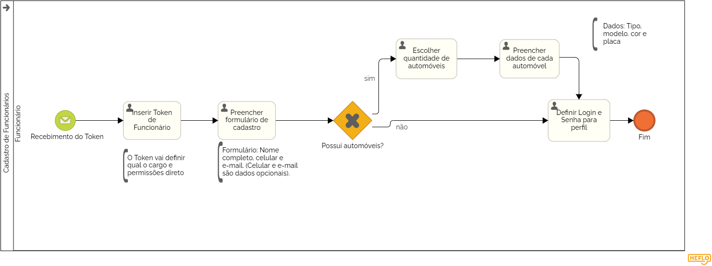

### 3.3.3 Processo 3 – CADASTRO DE FUNCIONÁRIOS

O Cadastro de Funcionário é um processo essencial que permite a integração de funcionários no nosso programa de gestão de condomínios. Este processo facilita a criação de perfis de funcionários e a definição de seus cargos e permissões dentro do sistema.

**Descrição do Processo:**

**1. Inserção do Token de Funcionário:** O funcionário inicia o processo inserindo um token único fornecido pelo síndico. Este token vincula o funcionário diretamente ao seu cargo e define suas permissões básicas no sistema.

**2. Preenchimento do Formulário de Cadastro:** Após a inserção do token, o funcionário preenche um formulário detalhado com informações pessoais e profissionais. O formulário coleta dados essenciais como nome, contato, cargo e qualquer outra informação relevante.

**3. Definição de Login e Senha:** O funcionário cria um login e senha para acessar a plataforma. Este passo é importante para garantir a segurança e a privacidade do acesso do funcionário ao sistema.

**4. Configuração de Permissões:** Com base nas informações fornecidas pelo funcionário e no cargo associado ao token, o sistema configura automaticamente as permissões de acesso necessárias. O síndico pode revisar e ajustar as permissões posteriormente, conforme necessário.

Este processo de cadastro é crucial para assegurar que todos os funcionários estejam devidamente registrados e configurados no sistema, permitindo uma gestão eficiente e organizada.

**Oportunidades de Melhoria no Cadastro de Funcionário**

**Desafios Anteriores:**

* O processo de cadastro de funcionários era frequentemente manual e não automatizado, levando a erros e ineficiências.
* Funcionários eram registrados em sistemas genéricos que não definiam claramente cargos e permissões, resultando em confusão e gestão ineficiente.
  
**Melhorias Implementadas:**

* Processo Automatizado: O novo processo de cadastro automatiza a integração de funcionários, garantindo uma configuração rápida e precisa.
* Token Direcionado: O uso de tokens específicos para cargos simplifica a atribuição de permissões e reduz erros de configuração.
* Formulário Detalhado: Coleta informações completas e necessárias para um registro adequado e preciso do funcionário.
* Configuração de Permissões: Permissões são configuradas automaticamente com base no cargo definido pelo token, com possibilidade de revisão e ajustes pelo síndico, melhorando a segurança e a gestão.

#### Detalhamento das atividades

_Descreva aqui cada uma das propriedades das atividades do processo 1. 
Devem estar relacionadas com o modelo de processo apresentado anteriormente._

_Os tipos de dados a serem utilizados são:_

_* **Área de texto** - campo texto de múltiplas linhas_

_* **Caixa de texto** - campo texto de uma linha_

_* **Número** - campo numérico_

_* **Data** - campo do tipo data (dd-mm-aaaa)_

_* **Hora** - campo do tipo hora (hh:mm:ss)_

_* **Data e Hora** - campo do tipo data e hora (dd-mm-aaaa, hh:mm:ss)_

_* **Imagem** - campo contendo uma imagem_

_* **Seleção única** - campo com várias opções de valores que são mutuamente exclusivas (tradicional radio button ou combobox)_

_* **Seleção múltipla** - campo com várias opções que podem ser selecionadas mutuamente (tradicional checkbox ou listbox)_

_* **Arquivo** - campo de upload de documento_

_* **Link** - campo que armazena uma URL_

_* **Tabela** - campo formado por uma matriz de valores_

**Nome da atividade 1**

| **Campo**       | **Tipo**         | **Restrições** | **Valor default** |
| ---             | ---              | ---            | ---               |
| [Nome do campo] | [tipo de dados]  |                |                   |
| ***Exemplo:***  |                  |                |                   |
| login           | Caixa de Texto   | formato de e-mail |                |
| senha           | Caixa de Texto   | mínimo de 8 caracteres |           |

| **Comandos**         |  **Destino**                   | **Tipo** |
| ---                  | ---                            | ---               |
| [Nome do botão/link] | Atividade/processo de destino  | (default/cancel  ) |
| ***Exemplo:***       |                                |                   |
| entrar               | Fim do Processo 1              | default           |
| cadastrar            | Início do proceso de cadastro  |                   |

**Nome da atividade 2**

| **Campo**       | **Tipo**         | **Restrições** | **Valor default** |
| ---             | ---              | ---            | ---               |
| [Nome do campo] | [tipo de dados]  |                |                   |
|                 |                  |                |                   |

| **Comandos**         |  **Destino**                   | **Tipo**          |
| ---                  | ---                            | ---               |
| [Nome do botão/link] | Atividade/processo de destino  | (default/cancel/  ) |
|                      |                                |                   |
