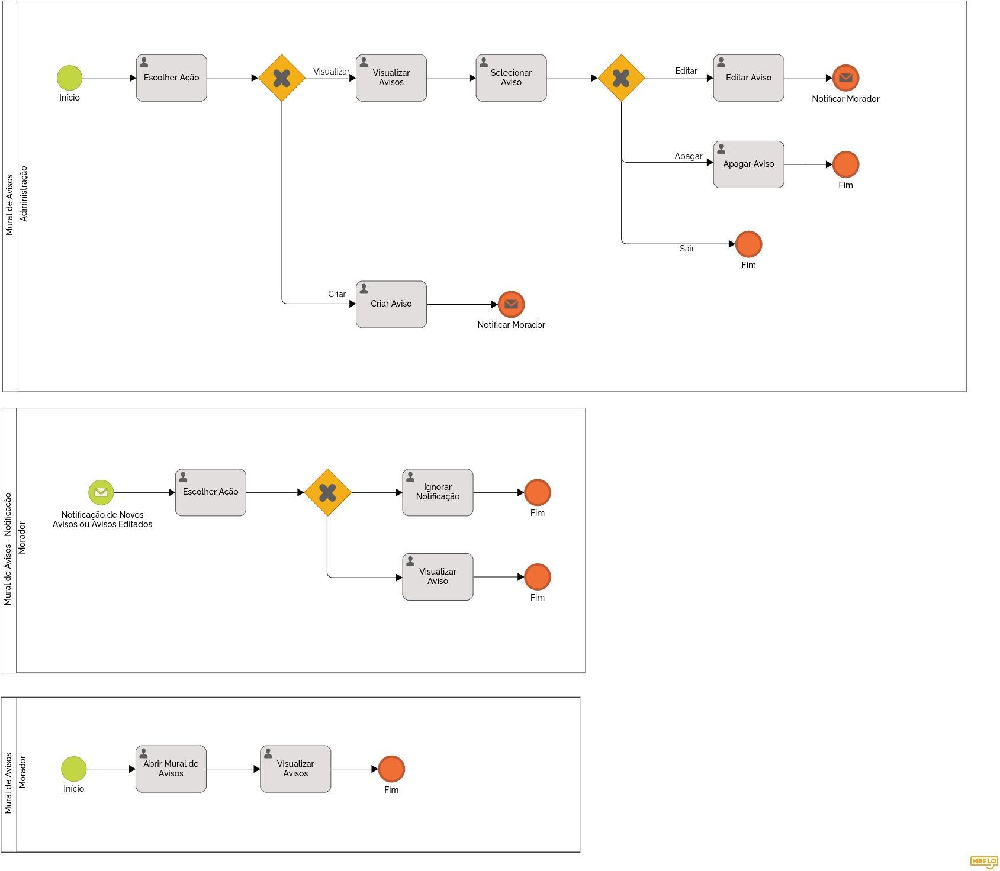

### 3.3.5 Processo 5 – MURAL DE AVISOS

#### Detalhamento das atividades

**Escolher Ação (Mural de Avisos)**

| **Campo**       | **Tipo**         | **Restrições**      | **Valor default** |
| ---             | ---              | ---                 | ---               |
| Ação            | Seleção Única    | Visualizar ou Criar | Visualizar        |

**Selecionar Aviso**

| **Campo**       | **Tipo**         | **Restrições**     | **Valor default** |
| ---             | ---              | ---                | ---               |
| Avisos          | Seleção Única    | Avisos Cadastrados | NULO              |

| **Comandos**         |  **Destino**                   | **Tipo**          |
| ---                  | ---                            | ---               |
| Editar               | Editar Aviso                   |                   |
| Apagar               | Apagar Aviso                   |                   |

**Criar Aviso**

| **Campo**       | **Tipo**         | **Restrições**           | **Valor default** |
| ---             | ---              | ---                      | ---               |
| Título          | Caixa de Texto   | Minímo de 10 Caracteres  | NULO              |
| Detalhes        | Área de Texto    | Mínimo de 10 Caracteres  | NULO              |
| Imagens         | Imagem           | Nenhuma                  | NULO              |
| Anexos          | Arquivo          | Nenhuma                  | NULO              |

| **Comandos**         |  **Destino**                   | **Tipo**          |
| ---                  | ---                            | ---               |
| Criar                | Notificar Moradores            |                   |
| Cancelar             | Fim                            | cancel            |

**Editar Aviso**

| **Campo**       | **Tipo**         | **Restrições**           | **Valor default** |
| ---             | ---              | ---                      | ---               |
| Título          | Caixa de Texto   | Minímo de 10 Caracteres  | NULO              |
| Detalhes        | Área de Texto    | Mínimo de 10 Caracteres  | NULO              |
| Imagens         | Imagem           | Nenhuma                  | NULO              |
| Anexos          | Arquivo          | Nenhuma                  | NULO              |

| **Comandos**         |  **Destino**                   | **Tipo**          |
| ---                  | ---                            | ---               |
| Salvar               | Notificar Moradores            |                   |
| Cancelar             | Fim                            | cancel            |

**Apagar Aviso**

| **Comandos**         |  **Destino**                   | **Tipo**          |
| ---                  | ---                            | ---               |
| Apagar               | Fim                            |                   |
| Cancelar             | Fim                            | cancel            |

**Escolher Ação (Mural de Avisos - Notificação)**

| **Comandos**         |  **Destino**                   | **Tipo**          |
| ---                  | ---                            | ---               |
| Ignorar              | Fim                            |                   |
| Abrir                | Visualizar Aviso               |                   |
