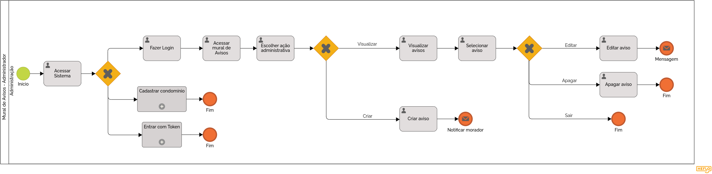
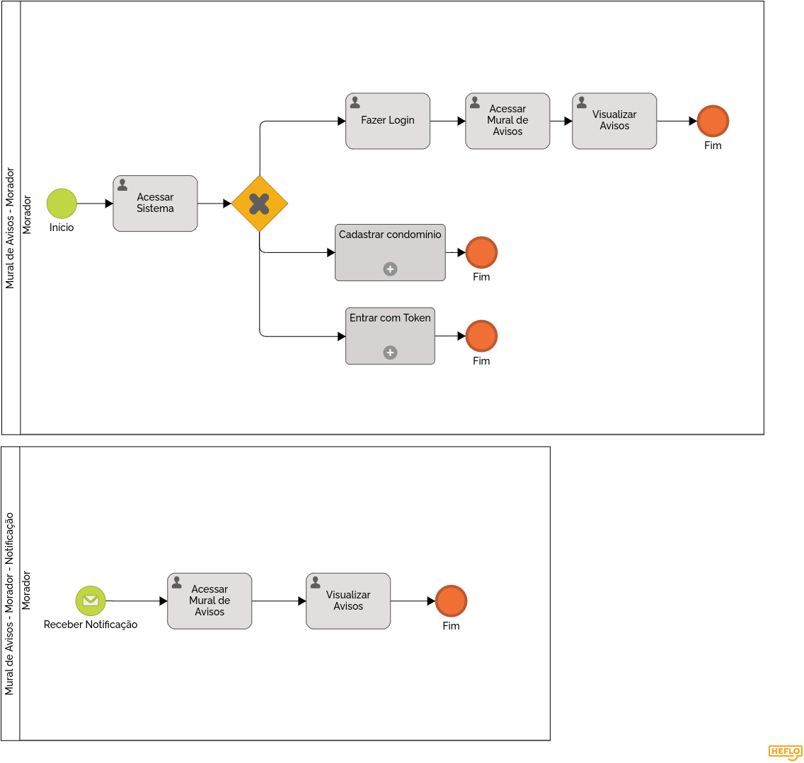

### 3.3.5 Processo 5 – MURAL DE AVISOS

O mural de avisos para o ambiente de convivência de um condomínio é muito importante para manter os moradores atualizados sobre a situação atual de seu lar.
O processo apresentado mostra como as informações sobre um aviso serão obtidas e repassadas aos moradores garantindo que as informações alcancem os inquilinos.

#### Descrição do Processo

**1. Postagem de Avisos:**

* A administração consegue fazer uma postagem à qualquer momento com informações relevantes ao comunicado, podendo incluir anexos como imagens e documentos. Nesse processo a administração também pode fazer alterações a postagens passadas ou excluí-las.

**2. Visualização de Avisos:**

* Tanto os moradores quanto a administração consegue visualizar os avisos postados e também recebem notificação em caso de qualquer alteração feita, seja ela um novo aviso, edição ou exclusão de um aviso passado.

#### Oportunidade de Melhoria

**Desafios Anteriores:**

* Os métodos atualmente utilizados, como grupos de WhatsApp, podem acabar ficando muito bagunçados com informações misturadas, gerando confusão tanto na administração quanto nos moradores.
* É difícil manter um histórico organizado de todos os avisos, gerando preocupação na administração por não poder indicar quando um aviso foi feito.
* Nem todos os moradores ficam cientes de todas as coisas que aconteciam no condomínio.

**Melhorias Implementadas:**

* Centralização: com um espaço dedicado aos avisos, a centralização é alcançada, auxiliando em uma organização mais eficiente.
* Histórico Claro: com a ajuda do sistema, as datas e informações ficam salvas, possibilitando a administração e os moradores saberem quando algo aconteceu.
* Aviso Imediato: o sistema de notificações possibilita que os moradores se mantenham sempre atualizados sobre o que está acontecendo.

#### Detalhamento das atividades

**Atividade 1: Acessar Sistema**

| **Comandos**           | **Destino**             | **Tipo**  |
|------------------------|-------------------------|-----------|
| [Fazer Login]          | Processo de Login       | default   |
| [Cadastrar Condomínio] | Processo de Token       | default   |
| [Entrar com Token]     | Acessar Mural de Avisos | default   |

**Escolher Ação (Mural de Avisos)**

| **Campo**       | **Tipo**         | **Restrições**      | **Valor default** |
| ---             | ---              | ---                 | ---               |
| Ação            | Seleção Única    | Visualizar ou Criar | Visualizar        |

**Selecionar Aviso**

| **Campo**       | **Tipo**         | **Restrições**     | **Valor default** |
| ---             | ---              | ---                | ---               |
| Avisos          | Seleção Única    | Avisos Cadastrados | NULO              |

| **Comandos**         |  **Destino**                   | **Tipo**          |
| ---                  | ---                            | ---               |
| Editar               | Editar Aviso                   |                   |
| Apagar               | Apagar Aviso                   |                   |

**Criar Aviso**

| **Campo**       | **Tipo**         | **Restrições**           | **Valor default** |
| ---             | ---              | ---                      | ---               |
| Título          | Caixa de Texto   | Minímo de 10 Caracteres  | NULO              |
| Detalhes        | Área de Texto    | Mínimo de 10 Caracteres  | NULO              |
| Imagens         | Imagem           | Nenhuma                  | NULO              |
| Anexos          | Arquivo          | Nenhuma                  | NULO              |

| **Comandos**         |  **Destino**                   | **Tipo**          |
| ---                  | ---                            | ---               |
| Criar                | Notificar Moradores            |                   |
| Cancelar             | Fim                            | cancel            |

**Editar Aviso**

| **Campo**       | **Tipo**         | **Restrições**           | **Valor default** |
| ---             | ---              | ---                      | ---               |
| Título          | Caixa de Texto   | Minímo de 10 Caracteres  | NULO              |
| Detalhes        | Área de Texto    | Mínimo de 10 Caracteres  | NULO              |
| Imagens         | Imagem           | Nenhuma                  | NULO              |
| Anexos          | Arquivo          | Nenhuma                  | NULO              |

| **Comandos**         |  **Destino**                   | **Tipo**          |
| ---                  | ---                            | ---               |
| Salvar               | Notificar Moradores            |                   |
| Cancelar             | Fim                            | cancel            |

**Apagar Aviso**

| **Comandos**         |  **Destino**                   | **Tipo**          |
| ---                  | ---                            | ---               |
| Apagar               | Fim                            |                   |
| Cancelar             | Fim                            | cancel            |

**Escolher Ação (Mural de Avisos - Notificação)**

| **Comandos**         |  **Destino**                   | **Tipo**          |
| ---                  | ---                            | ---               |
| Ignorar              | Fim                            |                   |
| Abrir                | Visualizar Aviso               |                   |
