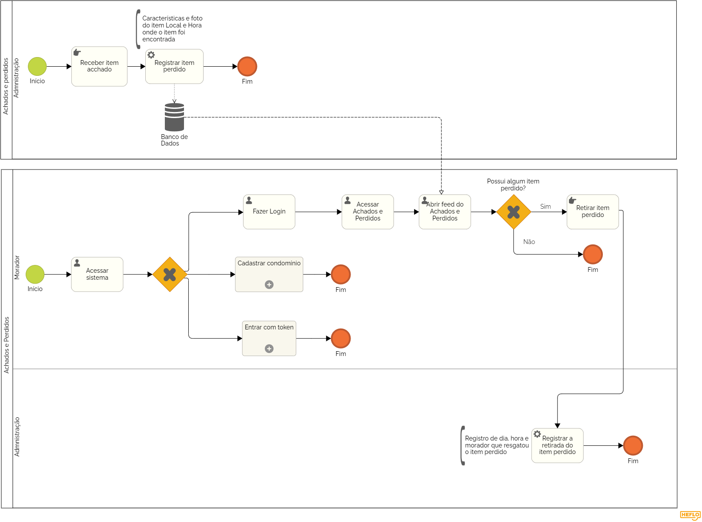

### 3.3.6 Processo 6 – ACHADOS E PERDIDOS

O processo de Achados e Perdidos é uma funcionalidade essencial para garantir que itens extraviados sejam facilmente identificados, registrados e recuperados dentro do condomínio. O sistema permite que tanto moradores quanto a administração tenham um fluxo claro para o gerenciamento de itens perdidos, garantindo maior eficiência e transparência.

**Descrição do Processo:**

**1. Acesso ao Feed de Itens Perdidos (Moradores):**
   
* O morador pode acessar o setor de Achados e Perdidos e visualizar um feed que contém postagens de todos os itens encontrados. Cada postagem exibe informações detalhadas, como uma foto do item e o local onde foi achado. O morador que identificar um item perdido pode ir até a administração para retirá-lo.

**2. Registro da Retirada do Item (Administração):**
   
* Ao identificar e retirar o item na administração, a retirada será registrada no sistema com a data e a hora da entrega. Esse processo garante que haja controle sobre a devolução dos itens encontrados, promovendo segurança e transparência.

**3. Recebimento de Itens Encontrados (Administração):**
   
* Quando um item é encontrado dentro do condomínio, a administração registra no sistema a foto do item, sua descrição e o local onde foi encontrado. Essas informações são publicadas no feed de Achados e Perdidos, que pode ser acessado pelos moradores, facilitando a localização e recuperação de itens perdidos.

**Oportunidades de Melhoria:**

**Desafios Anteriores:**

* Condomínios muitas vezes dependiam de registros manuais e comunicados informais para gerenciar itens perdidos, o que levava a confusões e perda de controle sobre os objetos. Muitos itens ficavam sem identificação ou eram mal administrados pela equipe.

**Melhorias Implementadas:**

* Registro Automatizado: O sistema de Achados e Perdidos agora centraliza e organiza todos os itens encontrados, proporcionando um controle mais eficiente.
* Transparência no Processo: O registro da retirada, com data e hora, oferece mais segurança para os moradores, garantindo que cada etapa do processo seja registrada de forma transparente.
* Facilidade para Moradores: A visualização de itens através do feed com fotos facilita a identificação de objetos, agilizando o processo de recuperação.

#### Detalhamento das atividades

**Atividade 1: Acessar sistema**

| Comandos         |  Destino                   | Tipo |
| ---                  | ---                            | ---               |
| [Fazer login] | Processo de Login   |default|
| [Usar Token]       |          Processo de Token               |   default                |
| [Cadastre seu condomínio]           | Cadastro do Condomínio              | default       |

**Atividade 2: Fazer Login (Obrigatória)**

| Campo       | Tipo         | Restrições | Valor default |
| ---             | ---              | ---            | ---               |
| login |     Caixa de Texto  |  formato de e-mail |                   |
| senha  |   Caixa de Texto   | mínimo de 8 caracteres      |                   |

| Comandos         |  Destino                   | Tipo |
| ---                  | ---                            | ---               |
| [Fazer login] | Página principal da plataforma  |default |
| [Cancelar]       |  Acesso ao sistema   |   cancel                |

**Atividade 2: Registrar Item Perdido (Administração)**

| **Campo**       | **Tipo**         | **Restrições** | **Valor default** |
| ---             | ---              | ---            | ---               |
| Nome do Item | Caixa de texto |  Texto simples, obrigatório  |                   |
| Descrição do Item | Área de texto	  | Detalhes sobre o item |                   |
| Local Onde Foi Encontrado |  Caixa de texto  |Texto simples, obrigatório |                   |
| Data em que Foi Encontrado | Data  |  Data do achado   |                   |
| Foto do Item (Opcional)  |   Imagem  |                |                   |

| **Comandos**         |  **Destino**                   | **Tipo**          |
| ---                  | ---                            | ---               |
|[Cadastrar Item]|Confirma cadastro  | Default |
|[Cancelar]  |     Fim do processo  |   Cancel  |

**Atividade 3: Abrir Feed de Achados e Perdidos (Moradores)**

| **Campo**       | **Tipo**         | **Restrições** | **Valor default** |
| ---             | ---              | ---            | ---               |
|Filtro de Nome do Item| Caixa de texto  |  Opcional  |                   |

| **Comandos**         |  **Destino**                   | **Tipo**          |
| ---                  | ---                            | ---               |
| [Buscar Itens]| Resultados de busca  |Default|
|    [Cancelar] |   Fim do processo      |     Cancel|

**Atividade 4: Registrar a Retirada de Item Perdido (Administradores)**

| **Campo**       | **Tipo**         | **Restrições** | **Valor default** |
| ---             | ---              | ---            | ---               |
|Item Selecionado | Seleção única | Baseada em itens cadastrados |                   |
|  Data de Retirada   |  Data  |                |                   |
|  Responsável pela Retirada |  Caixa de texto    |  Texto obrigatório |                   |

| **Comandos**         |  **Destino**                   | **Tipo**          |
| ---                  | ---                            | ---               |
|[Confirmar Retirada] | Confirma a retirada  | Default |
|  [Cancelar]   |    Fim do processo  |    Cancel   |
