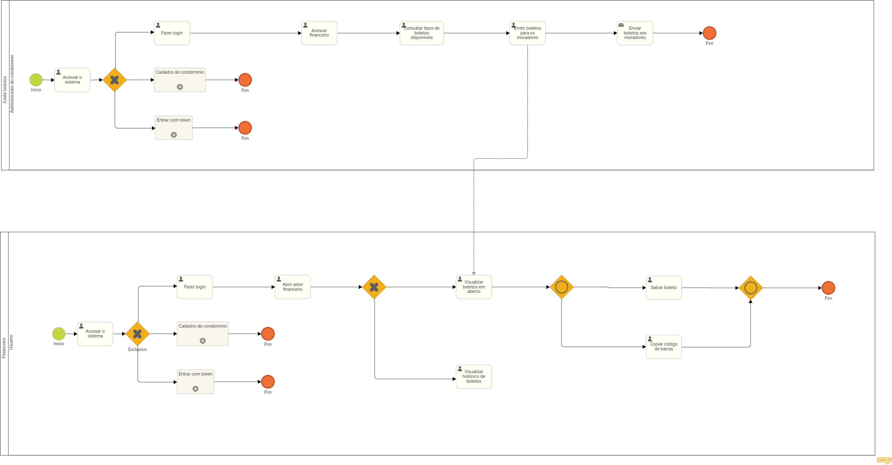

### 3.3.7 Processo 7 – FINANCEIRO

O processo de Financeiro é voltado tanto para a administração quanto para os moradores, garantindo que todas as cobranças relacionadas ao condomínio sejam organizadas e acessíveis. O sistema permite a emissão de boletos, visualização de cobranças em aberto, e consulta de pagamentos realizados, oferecendo uma gestão financeira clara e precisa.

**Descrição do Processo:**
**1. Emissão de Boletos (Administração):**

* O síndico ou a administração pode emitir boletos relacionados às taxas do condomínio, como água, gás, manutenção, e outros serviços. Esses boletos são gerados de acordo com as regras do condomínio e postados no sistema para que os moradores possam acessá-los. Também são incluídas taxas de reservas de áreas comuns, quando aplicável.

**2. Acesso ao Setor Financeiro (Moradores):**
* Os moradores podem acessar o setor Financeiro e visualizar todos os boletos gerados para o seu apartamento. A interface permite que eles vejam tanto os boletos em aberto quanto o histórico de pagamentos já efetuados, organizando as informações de maneira clara.

**3. Visualização e Pagamento (Moradores):**
O morador pode visualizar os boletos pendentes e utilizar as opções do sistema para copiar o código de barras e efetuar o pagamento via seu banco de preferência. Boletos gerados para reservas de áreas comuns também estarão disponíveis nesta seção.

**Oportunidades de Melhoria:**
**Desafios Anteriores:**

* Em muitos condomínios, a gestão financeira era feita de forma manual, ou através de sistemas que não integravam corretamente a emissão e acompanhamento de boletos. Isso causava atrasos, falhas na entrega de boletos, e dificuldades no acompanhamento das cobranças.
  
**Melhorias Implementadas:**

* Automação Financeira: O processo de emissão de boletos agora é centralizado e automatizado, garantindo que todos os moradores recebam suas cobranças de forma precisa e no tempo correto.
* Transparência e Organização: Os moradores têm fácil acesso ao histórico financeiro, podendo visualizar o que já foi pago e o que está pendente, promovendo maior controle sobre suas finanças.
* Integração com Reservas de Áreas Comuns: O sistema também vincula automaticamente boletos gerados para reservas, facilitando o pagamento dessas taxas adicionais.
* Cópia do Código de Barras: A opção de copiar o código de barras diretamente do sistema simplifica o processo de pagamento, economizando tempo e evitando erros.

#### Detalhamento das atividades

**Nome da atividade 1**

**Atividade 1 - Acessar o sistema**

| **Comandos**         |  **Destino**                   | **Tipo** |
| ---                  | ---                            | ---               |
| [Fazer login] | Processo de Login  | default   |default
| [Usar Token]       |          Processo de Token               |   default                |
| [Emitir boletos]           | Processo de Emitir boletos            | default       |

**Atividade 2 - Acessar financeiro**

| **Comandos**         |  **Destino**                   | **Tipo**          |
| ---                  | ---                             | ---               |
| [Financeiro]       | Processo Financeiro           | default          |
| [Emitir boletos]   | Emitir boletos            |  default          |

**Atividade 3 - Enviar boletos**

| **Comandos**         |  **Destino**                   | **Tipo**          |
| ---                  | ---                            | ---               |
| [Enviar boletos] | Processo Financeiro  |             | default          |

| **Campo**         |  **Tipo**                   | **Restrições**          | **Valor**         |  
| ---                |  ---                          | ---               | ---               |
|                       |                               |             |         |

