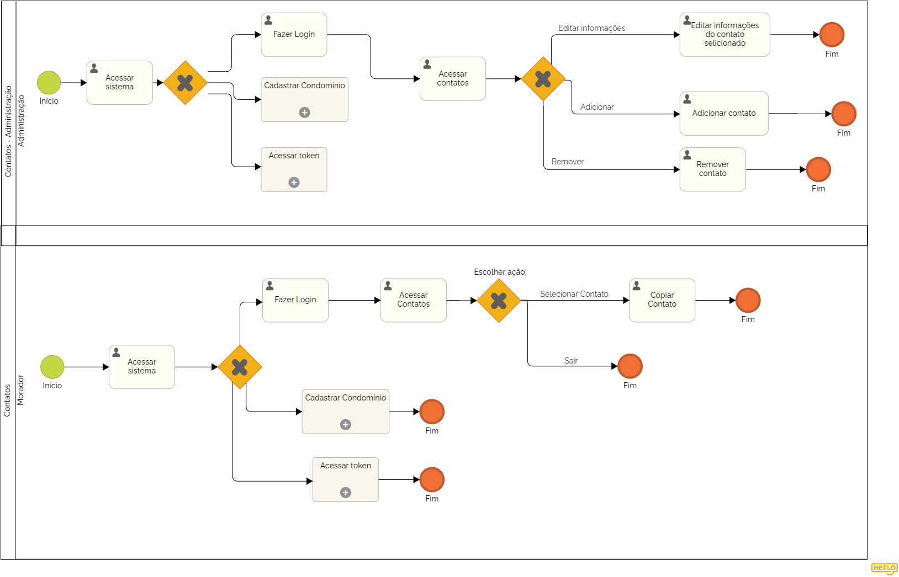

### 3.3.8 Processo 8 - CONTATOS

O processo de Contatos tem como objetivo organizar e disponibilizar os contatos úteis e importantes para a comunicação entre os moradores e a administração do condomínio. Ele é dividido entre o acesso e edição pela administração e a visualização pelos moradores.

**Descrição do Processo:**

**1. Gerenciamento de Contatos (Administração):**

* A administração tem acesso à lista de contatos do condomínio, podendo adicionar, editar ou remover informações. Esses contatos incluem o telefone da portaria, interfone, zelador, síndico e outros funcionários do condomínio. O administrador garante que todas as informações estejam atualizadas e acessíveis.

**2. Visualização de Contatos (Moradores):**

* O morador pode acessar a lista de contatos para visualizar as informações fornecidas pela administração. Isso inclui contatos para emergências, serviços do condomínio e informações sobre como se comunicar com os responsáveis.

**Oportunidades de Melhoria:**

**Desafios Anteriores:**

* Muitos condomínios não possuem um local centralizado para os contatos de serviço, o que pode causar atrasos na comunicação em situações de emergência ou necessidade de atendimento.

**Melhorias Implementadas:**

* Centralização das Informações: Os contatos agora estão organizados em um único lugar, facilitando o acesso rápido para moradores e administração.
* Facilidade de Edição: A administração pode atualizar facilmente as informações, mantendo os dados sempre atualizados e acessíveis.
  

#### Detalhamento das atividades

**Atividade 1: Acessar sistema**

| Comandos         |  Destino                   | Tipo |
| ---                  | ---                            | ---               |
| [Fazer login] | Processo de Login   |default|
| [Usar Token]       |          Processo de Token               |   default                |
| [Cadastre seu condomínio]           | Cadastro do Condomínio              | default       |

**Atividade 1.2: Fazer Login (Obrigatória)**

| Campo       | Tipo         | Restrições | Valor default |
| ---             | ---              | ---            | ---               |
| login |     Caixa de Texto  |  formato de e-mail |                   |
| senha  |   Caixa de Texto   | mínimo de 8 caracteres      |                   |

| Comandos         |  Destino                   | Tipo |
| ---                  | ---                            | ---               |
| [Fazer login] | Página principal da plataforma  |default |
| [Cancelar]       |  Acesso ao sistema   |   cancel                |

**Atividade 2: Gerenciamento de Contatos (Administradores)**

| **Campo**       | **Tipo**         | **Restrições** | **Valor default** |
| ---             | ---              | ---            | ---               |
| Nome do Contato | seleção única  | Texto simples, obrigatório    |         |
|Tipo de Contato | seleção única  | Portaria, Interfone, Zelador, Síndicor entre outros    |         |
| Informações de Contato | Área de texto  | Informações detalhadas |        |

| **Comandos**         |  **Destino**                   | **Tipo** |
| ---                  | ---                            | ---               |
| [Adicionar Contato] | Adiciona novo contato  | Default   |
|[Editar Contato] | Edita informações do contato  |Default   |
| [Remover Contato] | Remove contato selecionado  | Cancel   |

**Atividade 3: Visualização de Contatos (Moradores)**

| **Campo**       | **Tipo**         | **Restrições** | **Valor default** |
| ---             | ---              | ---            | ---               |
| Tipo de Contato | Seleção única  | Contatos Selecionados    |           |

| **Comandos**         |  **Destino**                   | **Tipo** |
| ---                  | ---                            | ---               |
| [Visualizar Contatos]|Mostra contatos disponíveis | Default   |

