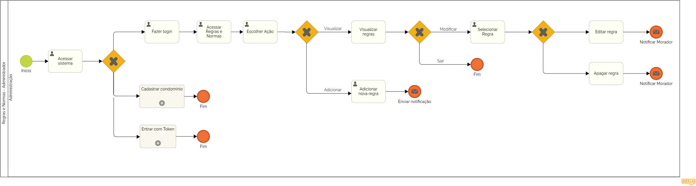
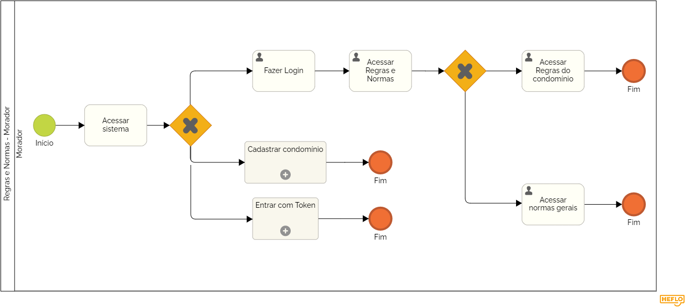

### 3.3.5 Processo 9 – Regras e Normas

O processo de Regras e Normas é voltado para a gestão e visualização das regras que regem o condomínio, oferecendo clareza tanto para a administração quanto para os moradores sobre os direitos e deveres dentro do espaço comum.

**Descrição do Processo:**

**1. Gerenciamento de Regras e Normas (Administração):**
A administração tem permissão para acessar, adicionar, editar e remover regras e normas do condomínio. Essas regras abrangem desde questões de convivência até o uso de áreas comuns e penalidades por infrações.

**2. Visualização de Regras e Normas (Moradores):**
Os moradores podem visualizar todas as regras e normas do condomínio, garantindo que tenham acesso rápido a informações sobre o que é permitido ou proibido nas áreas comuns e dentro de suas unidades.

**Oportunidades de Melhoria:**

**Desafios Anteriores:**

* As regras muitas vezes eram entregues em formato físico ou ficavam desatualizadas, o que causava confusão entre os moradores.

**Melhorias Implementadas:**

* Atualização Automática: O sistema permite que as regras sejam rapidamente atualizadas, garantindo que todos os moradores tenham acesso à versão mais recente.
* Facilidade de Acesso: As regras podem ser visualizadas a qualquer momento, evitando problemas de comunicação.

#### Detalhamento das atividades

_Descreva aqui cada uma das propriedades das atividades do processo 5. 
Devem estar relacionadas com o modelo de processo apresentado anteriormente._

_Os tipos de dados a serem utilizados são:_

_* **Área de texto** - campo texto de múltiplas linhas_

_* **Caixa de texto** - campo texto de uma linha_

_* **Número** - campo numérico_

_* **Data** - campo do tipo data (dd-mm-aaaa)_

_* **Hora** - campo do tipo hora (hh:mm:ss)_

_* **Data e Hora** - campo do tipo data e hora (dd-mm-aaaa, hh:mm:ss)_

_* **Imagem** - campo contendo uma imagem_

_* **Seleção única** - campo com várias opções de valores que são mutuamente exclusivas (tradicional radio button ou combobox)_

_* **Seleção múltipla** - campo com várias opções que podem ser selecionadas mutuamente (tradicional checkbox ou listbox)_

_* **Arquivo** - campo de upload de documento_

_* **Link** - campo que armazena uma URL_

_* **Tabela** - campo formado por uma matriz de valores_

**Nome da atividade 1**

| **Campo**       | **Tipo**         | **Restrições** | **Valor default** |
| ---             | ---              | ---            | ---               |
| [Nome do campo] | [tipo de dados]  |                |                   |
| ***Exemplo:***  |                  |                |                   |
| login           | Caixa de Texto   | formato de e-mail |                |
| senha           | Caixa de Texto   | mínimo de 8 caracteres |           |

| **Comandos**         |  **Destino**                   | **Tipo** |
| ---                  | ---                            | ---               |
| [Nome do botão/link] | Atividade/processo de destino  | (default/cancel  ) |
| ***Exemplo:***       |                                |                   |
| entrar               | Fim do Processo 1              | default           |
| cadastrar            | Início do proceso de cadastro  |                   |

**Nome da atividade 2**

| **Campo**       | **Tipo**         | **Restrições** | **Valor default** |
| ---             | ---              | ---            | ---               |
| [Nome do campo] | [tipo de dados]  |                |                   |
|                 |                  |                |                   |

| **Comandos**         |  **Destino**                   | **Tipo**          |
| ---                  | ---                            | ---               |
| [Nome do botão/link] | Atividade/processo de destino  | (default/cancel/  ) |
|                      |                                |                   |
