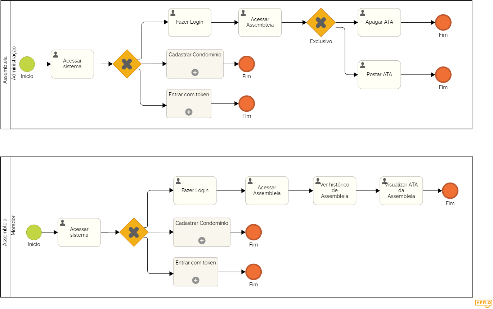

### 3.3.10 Processo 10 – ASSEMBLEIAS

O processo de Assembleias é voltado para o registro e compartilhamento das atas das reuniões de condomínio, garantindo que todos os moradores tenham acesso às decisões tomadas.

**Descrição do Processo:**

**1. Postagem das Atas de Assembleias (Administração):**

* A administração é responsável por postar as atas das assembleias no sistema. As atas contêm o resumo das discussões e decisões tomadas nas reuniões, incluindo votação de pautas e aprovações de projetos.

**2. Visualização das Atas (Moradores):**

* Os moradores podem acessar as atas de assembleias anteriores, organizadas por data, para revisar as decisões tomadas e acompanhar o que foi discutido.

**Oportunidades de Melhoria:**

**Desafios Anteriores:**

* Nem todos os moradores tinham acesso às atas, causando falta de transparência nas decisões da gestão do condomínio.

**Melhorias Implementadas:**

* Acesso Facilitado: As atas são publicadas no sistema e ficam acessíveis a todos os moradores, garantindo que todos tenham ciência das decisões.
* Organização por Data: As atas são organizadas de forma clara, facilitando a pesquisa e consulta.

#### Detalhamento das atividades

**Atividade 1: Acessar Assembleia (Administrador)**

| **Campo**       | **Tipo**         | **Restrições** | **Valor default** |
| ---             | ---              | ---            | ---               |
| Data da Assembleia | Data  | Data da assembleia realizada  |                   |
|  Ata da Assembleia| Arquivo   |  Documento PDF contendo a ata   |                   |

| **Comandos**         |  **Destino**                   | **Tipo**          |
| ---                  | ---                            | ---               |
| [Publicar Ata] | Publicação da ata selecionada  | Default|

**Atividade 2: Ver Histórico de Assembleia (Moradores)**

| **Campo**       | **Tipo**         | **Restrições** | **Valor default** |
| ---             | ---              | ---            | ---               |
|Lista de Assembleias | Tabela  |   Lista de atas de assembleia disponíveis para visualização   |                   |

| **Comandos**         |  **Destino**                   | **Tipo**          |
| ---                  | ---                            | ---               |
| [Visualizar Ata] |Detalhes da ata selecionada  | Default|

