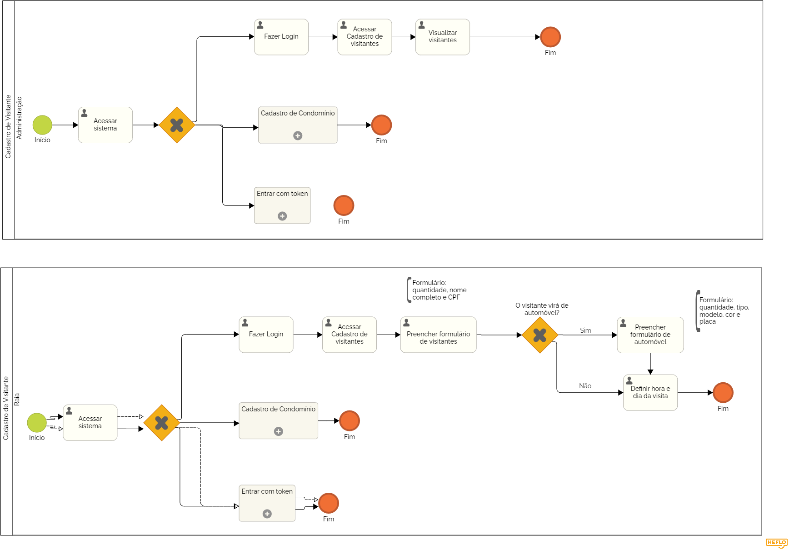

### 3.3.11 Processo 11 – Cadastro de Visitantes

O processo de Cadastro de Visitantes permite que os moradores registrem seus convidados e que a administração tenha controle sobre as visitas recebidas.

**Descrição do Processo:**

**1. Cadastro de Visitantes (Moradores):**

* O morador pode registrar a visita de convidados preenchendo um formulário com o número de visitantes, nomes, CPF, e detalhes do veículo (se houver), como tipo, modelo, cor e placa. O morador também define a data e o horário da visita.

**2. Visualização de Visitantes (Administração):**
* A administração pode acessar a lista de visitantes cadastrados para cada apartamento, garantindo um controle de quem está autorizado a entrar no condomínio e em quais horários.

**Oportunidades de Melhoria:**

**Desafios Anteriores:**

* O controle de visitantes era muitas vezes feito manualmente, resultando em falhas de segurança e entradas não autorizadas.

**Melhorias Implementadas:**

* Registro Digital: O cadastro de visitantes digitaliza o processo, melhorando a segurança e evitando fraudes.
* Acesso em Tempo Real: A administração tem acesso imediato aos registros de visitantes, facilitando o controle de entrada.

#### Detalhamento das atividades

**Atividade 1: Acessar Cadastro de Visitantes (Morador)**

| **Campo**       | **Tipo**         | **Restrições** | **Valor default** |
| ---             | ---              | ---            | ---               |
|Nome do Visitante |Caixa de texto |     Nome completo do visitante        |                  |
| CPF do Visitante | Caixa de texto | Número válido de CPF      |                  |
| Veículo (Opcional)| Número |   Número de veículos (se aplicável)          |                  |

| **Comandos**         |  **Destino**                   | **Tipo** |
| ---                  | ---                            | ---               |
|[Confirmar Cadastro] |Finalização do cadastro do visitante  | 	Default |
|[Cadastro de veículos]             | Finalização do cadastro do visitante            | default           |
|[Cancelar]         | Cancelamento do cadastro  |    Cancel     |

**Atividade 2: Preencher Formulário de Cadastro de Automóveis (Moradores - se aplicável)**

| **Campo**       | **Tipo**         | **Restrições** | **Valor default** |
| ---             | ---              | ---            | ---               |
| Quantidade de automóveis | Número  |	Valor inteiro positivo|    0   |
| Tipo de automóvel |  Seleção Única  |  Carro/Moto/Outro  |  	Carro   |
| Modelo do automóvel  |  	Caixa de Texto | Não pode estar vazio se "Quantidade" for maior que 0  |                   |
| Cor do automóvel | 	Caixa de Texto | Não pode estar vazio se "Quantidade" for maior que 0|                   |
| Placa do automóvel	  | 	Caixa de Texto| Formato de placa (AAA-1234 ou ABC1D23) |                   |

| **Comandos**         |  **Destino**                   | **Tipo** |
| ---                  | ---                            | ---               |
|[Confirmar Cadastro] |Finalização do cadastro do visitante  | 	Default |
|[Cancelar]         | Cancelamento do cadastro  |    Cancel     |

**Atividade 3: Visualizar Visitantes**

| **Campo**       | **Tipo**         | **Restrições** | **Valor default** |
| ---             | ---              | ---            | ---               |
|Lista de Visitantes	 | Tabela |   Lista de visitantes cadastrados         |                  |

| **Comandos**         |  **Destino**                   | **Tipo** |
| ---                  | ---                            | ---               |
|[Visualizar Visitante] |Detalhes do visitante selecionado | 	Default |
|[Cancelar]         | Cancelamento do cadastro  |    Cancel     |

