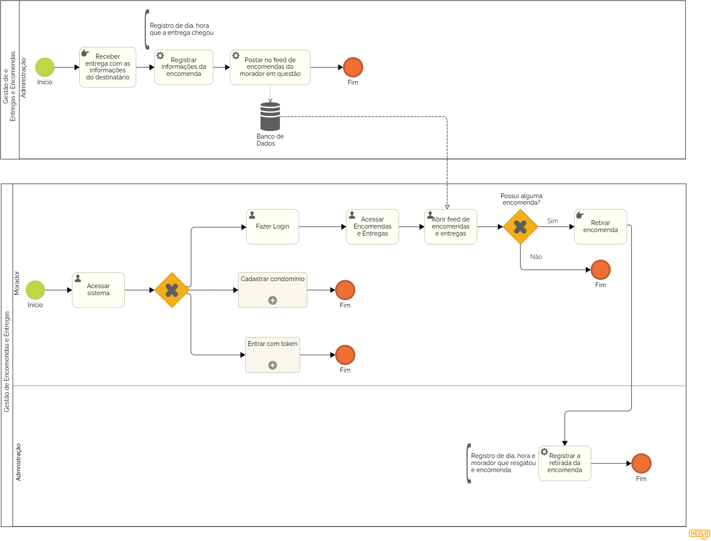

### 3.3.12 Processo 12 – ENTREGAS E ENCOMENDAS

O processo de Entregas e Encomendas gerencia a chegada e retirada de encomendas no condomínio, oferecendo um fluxo claro tanto para a administração quanto para os moradores.

**Descrição do Processo:**

**1. Registro de Entregas (Administração):**

* A administração posta no sistema todas as encomendas recebidas, registrando a data, a hora e incluindo uma foto da encomenda. O morador é notificado de que a encomenda está disponível para retirada.

**2. Retirada da Encomenda (Moradores):**

* O morador visualiza o feed de encomendas no sistema, identificando suas encomendas. Após retirar a encomenda, a administração registra a data e hora da retirada, bem como o nome da pessoa que efetuou a retirada.

**Oportunidades de Melhoria:**

**Desafios Anteriores:**

* O controle de encomendas era muitas vezes feito manualmente, levando a perdas ou extravios de pacotes.

**Melhorias Implementadas:**

* Notificação Automática: Os moradores são notificados automaticamente quando uma encomenda chega, melhorando a eficiência.
* Controle de Retirada: A administração registra a retirada de forma organizada, evitando extravios.
  

#### Detalhamento das atividades

**Atividade 1: Registro de Recebimento de Encomendas (Administrador)**

| **Campo**       | **Tipo**         | **Restrições** | **Valor default** |
| ---             | ---              | ---            | ---               |
| Foto da Encomenda  | Imagem | 	Foto da encomenda recebida|              |
| Data de Recebimento  | Data e Hora   | Data e hora do recebimento da encomenda |               |

| **Comandos**         |  **Destino**                   | **Tipo** |
| ---                  | ---                            | ---               |
|[Registrar Recebimento]            | Finalização do registro de recebimento             |Default       |
|[Cancelar]       | Cancelamento do registro             |Cancel      |

**Atividade 2: Visualização de Entregas e Encomendas (Morador)**

| **Campo**       | **Tipo**         | **Restrições** | **Valor default** |
| ---             | ---              | ---            | ---               |
|Lista de Encomendas  | Tabela| 	Lista de encomendas disponíveis para retirada|              |

| **Comandos**         |  **Destino**                   | **Tipo** |
| ---                  | ---                            | ---               |
|[Cancelar]       | Cancelamento do registro             |Cancel      |

**Atividade 3: Registro de Retirada da Encomenda**

| **Campo**       | **Tipo**         | **Restrições** | **Valor default** |
| ---             | ---              | ---            | ---               |
|Nome do morador  | Caixa de Texto| obrigatório|              |
| Data de Retirada| Data e Hora   | Data e hora da retirada da encomenda |               |

| **Comandos**         |  **Destino**                   | **Tipo** |
| ---                  | ---                            | ---               |
|[Confirmar Registro]       |Confirmação do registro             |Default   |
|[Cancelar]       | Cancelamento do registro             |Cancel      |
