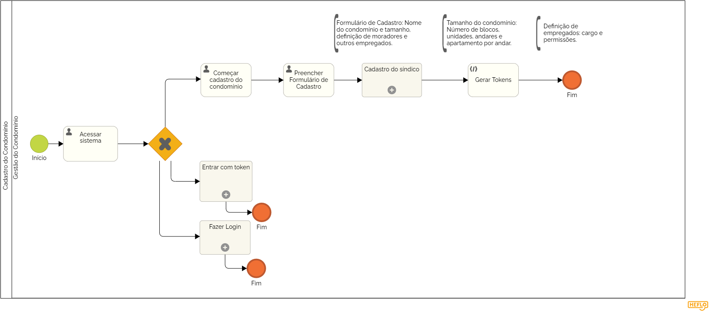

### 3.3.13 Processo 13 – Cadastro do Condomínio

**Sub Processo - Cadastro do Síndico**

#### Detalhamento das atividades

**Inserir nome do Condomínio**

| **Campo**       | **Tipo**         | **Restrições** | **Valor default** |
| ---             | ---              | ---            | ---               |
| Nome do Condomínio         | Caixa de texto            |     mínimo de 2 caracteres     |              |

**Definir tamanho do condomínio**

| **Campo**       | **Tipo**         | **Restrições** | **Valor default** |
| ---             | ---              | ---            | ---               |
| Quantidade de blocos (prédios) | Número  |     mínimo 1 prédio           |       1            |
| Número de andares | Número  |     mínimo 1 andar           |       1            |
| Número de apartamentos por andar | Número  |     mínimo 1 apartamento           |       1            |

**Cadastro do síndico**

| **Campo**       | **Tipo**         | **Restrições** | **Valor default** |
| ---             | ---              | ---            | ---               |
| Nome             | Área de Texto  |                |    mínimo de 2 caracteres               |
|      Celular  com DDD     |      Área de Texto            |        mínimo de 10 caracteres        |                   |
|      E-mail        |         Área de Texto         |         formato de e-mail       |                   |

| **Comandos**         |  **Destino**                   | **Tipo**          |
| ---                  | ---                            | ---               |
| [Deseja incluir outros funcionários?] | Início do processo de cadastro de funcionários  | (default  ) |

**Definir tipo e permissões**

| **Campo**       | **Tipo**         | **Restrições** | **Valor default** |
| ---             | ---              | ---            | ---               |
| Quantidade | Número  |     mínimo 1 funcionário          |       1            |
| Cargo | Área de Texto  |     mínimo de 2 caracteres           |                   |

