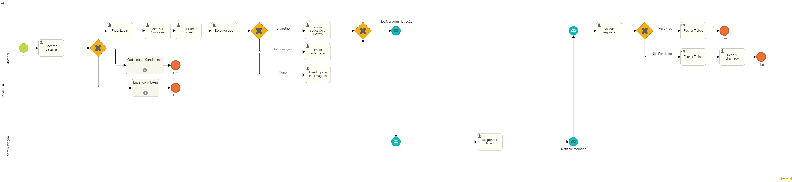

### 3.3.2 Processo z – Ouvidoria

O processo de Ouvidoria é uma ferramenta para que os moradores registrem sugestões, reclamações ou solicitações, permitindo que a administração responda de maneira organizada e eficiente.

**Descrição do Processo:**

**1. Abertura de Tickets (Moradores):**

* O morador pode abrir tickets para registrar reclamações, sugestões ou solicitações, descrevendo o problema e anexando imagens, se necessário. O ticket é encaminhado para a administração para análise.

**2. Resposta e Resolução (Administração):**

* A administração avalia o ticket, responde com uma solução ou solicitação de mais informações. Caso resolvido, o ticket é fechado pelo morador. Se não, o ticket pode ser reaberto para mais esclarecimentos.

**Oportunidades de Melhoria:**

**Desafios Anteriores:**

* A comunicação entre moradores e administração era frequentemente informal, resultando em questões não resolvidas ou mal interpretadas.

**Melhorias Implementadas:**

* Sistema Organizado de Tickets: Agora todas as solicitações são centralizadas e registradas, facilitando o acompanhamento e a resolução.
* Feedback do Morador: O morador pode validar se o problema foi resolvido, garantindo um processo mais transparente.

#### Detalhamento das atividades

**Escolher Tipo**

| **Campo**       | **Tipo**         | **Restrições**                | **Valor default** |
| ---             | ---              | ---                           | ---               |
| Tipo do Ticket  | Seleção Única    | Sugestão, Reclamação ou Outro | Outro             |

**Inserir Sugestão e Motivo**

| **Campo**       | **Tipo**         | **Restrições**        | **Valor default** |
| ---             | ---              | ---                   | ---               |
| Sugestão        | Caixa de Texto   | Mínimo de 10 palavras | NULO              |
| Motivo          | Área de Texto    | Mínimo de 10 palavras | NULO              |

| **Comandos**         |  **Destino**                   | **Tipo**          |
| ---                  | ---                            | ---               |
| Enviar               | Analisar Ticket                | default           |

**Inserir Reclamação**

| **Campo**       | **Tipo**         | **Restrições**        | **Valor default** |
| ---             | ---              | ---                   | ---               |
| Reclamação      | Área de Texto    | Mínimo de 10 Palavras | NULO              |
| Anexo           | Imagens          | Nenhuma               | NULO              |

| **Comandos**         |  **Destino**                   | **Tipo**          |
| ---                  | ---                            | ---               |
| Enviar               | Analisar Ticket                | default           |

**Inserir Tipo e Informações**

| **Campo**       | **Tipo**         | **Restrições**        | **Valor default** |
| ---             | ---              | ---                   | ---               |
| Tipo            | Caixa de Texto   | Mais de 4 letras      | NULO              |
| Reclamação      | Área de Texto    | Mínimo de 10 Palavras | NULO              |
| Anexo           | Imagens          | Nenhuma               | NULO              |

| **Comandos**         |  **Destino**                   | **Tipo**          |
| ---                  | ---                            | ---               |
| Enviar               | Analisar Ticket                | default           |

**Responder o Ticket**

| **Campo**       | **Tipo**         | **Restrições**        | **Valor default** |
| ---             | ---              | ---                   | ---               |
| Resposta        | Área de Texto    | Mínimo de 10 Palavras | NULO              |

| **Comandos**         |  **Destino**                   | **Tipo**          |
| ---                  | ---                            | ---               |
| Enviar               | Validar Resposta               | default           |
