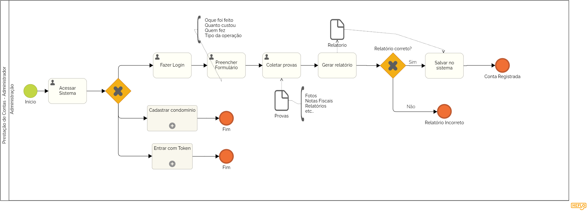
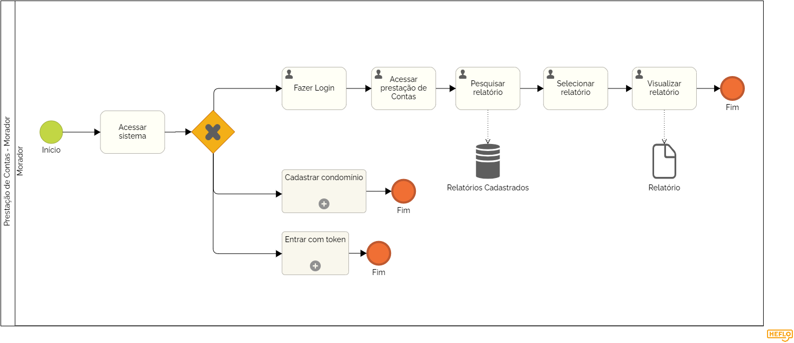

### 3.3.4 Processo 4 – Prestação de contas

_Apresente aqui o nome e as oportunidades de melhoria para o processo 4. 
Em seguida, apresente o modelo do processo 4, descrito no padrão BPMN._

#### Detalhamento das atividades

**Inserir Informações da Conta**

| **Campo**       | **Tipo**         | **Restrições** | **Valor default** |
| ---             | ---              | ---            | ---               |
| Nome            | Caixa de Texto   | formato de e-mail |                |
| Preço           | Numero           | mínimo de 8 caracteres |           |
| Responsavel     | Caixa de Texto   | mínimo de 3 caracteres |           |
| Tipo            | eleção única     | Pelo menos uma opção selecionada |  Serviço     |

| **Comandos**         |  **Destino**                   | **Tipo** |
| ---                  | ---                            | ---               |
| Anexar Provas        | Coletar provas                 | default           |

**Visualizar Provas**

| **Campo**       | **Tipo**         | **Restrições** | **Valor default** |
| ---             | ---              | ---            | ---               |
| Provas          | Arquivos         | Aquivo de imagem ou PDF|                   |

| **Comandos**         |  **Destino**                   | **Tipo**          |
| ---                  | ---                            | ---               |
| Visualizar relatorio |  Gera relatorio                | default           |
| Salver relatorio     |  Finalizar processo            | default           |
